# Dynamics of Electrical Machines and Drives (DEMD)
## Cascaded Speed Control of an ATM "Carrelli 1928" Tramway SEDC Drive

[](https://www.polimi.it/)
[](https://www.mathworks.com/products/simulink.html)
[](LICENSE)

This repository hosts the final design project for the **Dynamics of Electrical Machines and Drives (DEMD)** course (A.Y. 2025/2026), Master of Science in *Automation and Control Engineering* at **Politecnico di Milano**.

The project investigates, develops, tunes, and validates a complete **three-loop cascaded speed control architecture** for a separately excited DC motor (SEDC) propulsion system modeling the iconic **ATM "Carrelli 1928"** tramway of Milan. The system is evaluated along a realistic **10 km** mission profile featuring grade changes ($\pm 5\%$) and multi-stage speed limits.

---

## Table of Contents

- [Overview & Objectives](#overview--objectives)
- [Theoretical Background & System Architecture](#theoretical-background--system-architecture)
  - [1. Mechanical Subsystem & Vehicle Dynamics](#1-mechanical-subsystem--vehicle-dynamics)
  - [2. SEDC Machine Electromechanical Model](#2-sedc-machine-electromechanical-model)
  - [3. Cascaded Three-Loop Control Architecture](#3-cascaded-three-loop-control-architecture)
  - [4. Field Weakening Strategy](#4-field-weakening-strategy)
  - [5. Actuator Saturation & Anti-Windup Strategies](#5-actuator-saturation--anti-windup-strategies)
- [Repository Structure](#repository-structure)
- [Prerequisites & Dependencies](#prerequisites--dependencies)
- [Quick Start & Execution Guide](#quick-start--execution-guide)
  - [Step 1: Parameter Initialization & Controller Synthesis](#step-1-parameter-initialization--controller-synthesis)
  - [Step 2: Running the Simulink Simulation](#step-2-running-the-simulink-simulation)
  - [Step 3: Post-Processing & Figure Generation](#step-3-post-processing--figure-generation)
- [Simulation Results & Verification](#simulation-results--verification)
- [References & Credits](#references--credits)

---

## Overview & Objectives

The primary objective is the high-fidelity modeling and analytical synthesis of Proportional-Integral (PI) controllers for speed and current regulation of the ATM 1928 tramway drive under severe non-linearities and physical actuator constraints:

1. **Timescale Separation**: Designing three decoupled closed-loop controllers to enforce adequate separation between the ultrafast armature current dynamics ($\approx 10\text{ ms}$ response), intermediate excitation/field dynamics, and slower mechanical vehicle acceleration.
2. **Autonomous Field Weakening**: Progressively reducing the excitation current above base speed ($\Omega_b \approx 101.58\text{ rad/s}$, corresponding to $v_b \approx 21.84\text{ km/h}$) up to the maximum speed of $42\text{ km/h}$, preventing back-EMF from exceeding the $600\text{ V}$ DC-link voltage.
3. **Robust Anti-Windup Management**: Handling multi-level physical limits via tracking-mode anti-windup on armature voltage ($\pm 600\text{ V}$), back-calculation anti-windup on field voltage ($\pm 60\text{ V}$), rigid clamping on armature current ($\pm 156\text{ A}$), and asymmetric torque limits (with electrical regenerative braking up to $-3 T_{nom}$).
4. **Disturbance Rejection**: Suppressing gravity-induced load torque variations caused by track slopes ($\pm 5\%$) while ensuring passenger comfort and trajectory fidelity.

---

## Theoretical Background & System Architecture

```mermaid
flowchart LR
    subgraph PosLoop ["Kinematics & Track Mission Profile"]
        Pos["Distance x(t)"] --> DistTable["1-D LUT Mission Profile"]
        DistTable --> Vref["v_ref(t)"]
        DistTable --> Tr["Load Torque Tr(t)"]
    end

    subgraph SpeedLoop ["Outer Velocity Loop (50 rad/s)"]
        Vref --> ErrV["+ / -"]
        ErrV --> PIspeed["PI Speed Controller\n(Anti-Windup)"]
        PIspeed --> Tref["T_ref bounded\n[-3 Tnom, Tmax]"]
    end

    subgraph FieldLoop ["Field Excitation Loop (100 rad/s)"]
        Omega["Motor Speed Omega(t)"] --> FWlogic["Field Weakening Logic\nie,ref = En / (K * Omega)"]
        FWlogic --> PIfield["PI Field Controller"]
        PIfield --> Ve["Field Voltage Ve(t) [±60V]"]
        Ve --> FieldCkt["Excitation Circuit\n1 / (Le*s + Re)"]
        FieldCkt --> Ie["Field Current ie(t)"]
    end

    subgraph ArmatureLoop ["Inner Armature Loop (900 rad/s)"]
        Tref --> Div["ia,ref = Tref / (K * ie)"]
        Div --> SatIa["Current Saturation ±156 A"]
        SatIa --> ErrIa["+ / -"]
        ErrIa --> PIarm["PI Armature Controller"]
        PIarm --> Decouple["+ Back-EMF Feedforward\nE = K * ie * Omega"]
        Decouple --> SatVa["Voltage Saturation\n±600 V (Tracking Mode)"]
        SatVa --> ArmCkt["Armature Circuit\n1 / (La*s + Ra)"]
        ArmCkt --> Ia["Armature Current ia(t)"]
    end

    subgraph PlantMech ["Mechanical Plant"]
        Ia & Ie --> Tmot["Tmot = K * ie * ia"]
        Tmot & Tr --> SumT["Tmot - Tr - beta*Omega"]
        SumT --> MechTF["1 / (Jeq*s + beta)"]
        MechTF --> Omega
        Omega --> IntSpeed["v(t) = Omega * r * rho"]
        IntSpeed --> Pos
    end
```



### 1. Mechanical Subsystem & Vehicle Dynamics

The vehicle propulsion is delivered by 4 identical DC traction motors mechanically coupled via a reduction gear ratio $\rho$:

| Parameter | Symbol | Value | Unit |
| :--- | :--- | :--- | :--- |
| Empty tram mass | $m_T$ | $15\,000$ | $\text{kg}$ |
| Passenger capacity (130 passengers $\times 80\text{ kg}$) | - | $10\,400$ | $\text{kg}$ |
| Full load gross vehicle mass | $M$ | $25\,400$ | $\text{kg}$ |
| Wheel diameter | $d$ | $0.680$ | $\text{m}$ (radius $r = 0.340\text{ m}$) |
| Gearbox reduction ratio (motor-to-wheel) | $\rho$ | $13/74 \approx 0.17568$ | $[-]$ |
| Viscous friction coefficient | $\beta$ | $0.81$ | $\text{N}\cdot\text{m}\cdot\text{s}$ |
| Equivalent rotational inertia referred to motor shaft | $J_{eq}$ | $M \frac{\rho^2 d^2}{4} \approx 90.62$ | $\text{kg}\cdot\text{m}^2$ |

The gravitational disturbance torque reflected to the motor shaft due to track slope angle $\theta = \arctan\left(\frac{\text{slope}\%}{100}\right)$ is:
$$T_r(t) = M \cdot g \cdot r \cdot \rho \cdot \sin\left(\arctan\left(\frac{\text{slope}\%}{100}\right)\right)$$

The rotational dynamic equilibrium at the shaft is governed by:
$$J_{eq} \frac{d\Omega(t)}{dt} + \beta \Omega(t) = T_{mot}(t) - T_r(t)$$

---

### 2. SEDC Machine Electromechanical Model

The tramway utilizes 4 separately excited DC machines operating in parallel across a $V_{DC} = 600\text{ V}$ overhead contact line:

| Electrical Parameter | Symbol | Value | Description |
| :--- | :--- | :--- | :--- |
| DC overhead line voltage | $V_{DC}$ | $600\text{ V}$ | Armature converter physical rail |
| Rated field voltage | $V_{e,n}$ | $60\text{ V}$ | Field chopper supply limit |
| Rated field current | $I_{e,n}$ | $5\text{ A}$ | Full-flux excitation current |
| Field circuit resistance | $R_e$ | $12\ \Omega$ | $\tau_e = 0.1\text{ s} \implies L_e = 1.2\text{ H}$ |
| Total rated armature current | $I_{a,n}$ | $156\text{ A}$ | Equivalent 4-motor armature rating |
| Equivalent armature resistance | $R_a$ | $0.39\ \Omega$ | $\tau_a = 10\text{ ms} \implies L_a = 3.9\text{ mH}$ |
| Torque & back-EMF constant | $K$ | $1.06\text{ N}\cdot\text{m/A}^2$ | $T_{mot} = K i_e i_a$, $E = K i_e \Omega$ |
| Total rated electrical power | $P_{tot}$ | $4 \times 21 = 84\text{ kW}$ | Aggregate 4-motor rating |
| Base rotational speed | $\Omega_b$ | $970\text{ rpm} \approx 101.58\text{ rad/s}$ | Linear base speed $v_b \approx 21.84\text{ km/h}$ |
| Nominal shaft torque | $T_{nom}$ | $P_{tot} / \Omega_b \approx 826.93\text{ N}\cdot\text{m}$ | Controller normalization baseline |
| Nominal back-EMF | $E_n$ | $V_{DC} - R_a I_{a,n} = 539.16\text{ V}$ | Computed at full load rated point via KVL |

---

### 3. Cascaded Three-Loop Control Architecture

All PI regulators are synthesized using the **pole-zero cancellation method**, enforcing a predictable first-order closed-loop transfer function with precise crossover bandwidth $\omega_c$:

$$G(s) = \frac{1/R}{1 + \tau s}, \quad C(s) = K_p \frac{1 + \tau s}{\tau s} \implies L(s) = \frac{K_p}{R \tau s}, \quad \omega_c = \frac{K_p}{L} \implies K_p = L \omega_c, \quad K_i = R \omega_c$$

1. **Armature Current Loop (Fastest Inner Loop)**:
   - Bandwidth: $\omega_{c,a} = 900\text{ rad/s}$ (settling time $\approx 10\text{ ms}$)
   - Gains: $K_{p,a} = L_a \omega_{c,a} = 3.51$, $K_{i,a} = R_a \omega_{c,a} = 351$
   - Back-EMF Feedforward: $E(t) = K i_e(t) \Omega(t)$ is directly added to the PI output to decouple electromechanical back-voltage.
2. **Field Current Loop (Excitation Subsystem)**:
   - Bandwidth: $\omega_{c,e} = 100\text{ rad/s}$
   - Gains: $K_{p,e} = L_e \omega_{c,e} = 120$, $K_{i,e} = R_e \omega_{c,e} = 1200$
3. **Vehicle Velocity Loop (Outer Mechanical Loop)**:
   - Bandwidth: $\omega_{c,\omega} = 50\text{ rad/s}$ (tuned for sharp response and actuator stress-testing)
   - Gains: $K_{p,\omega} = J_{eq} \omega_{c,\omega} = 4531$, $K_{i,\omega} = \beta \omega_{c,\omega} = 40.5$

---

### 4. Field Weakening Strategy

When the vehicle speed exceeds the base threshold $\Omega_b$ ($v > v_b \approx 21.84\text{ km/h}$), the back-EMF would exceed $E_n$ and saturate against the $600\text{ V}$ rail if nominal flux were maintained. The excitation current reference is therefore dynamically scheduled as an inverse function of speed:

$$i_{e,ref}(t) = \begin{cases} I_{e,n} = 5\text{ A}, & \Omega(t) \le \Omega_b \\ \frac{E_n}{K \cdot \Omega(t)}, & \Omega(t) > \Omega_b \end{cases}$$

At top speed $v_{max} = 42\text{ km/h}$ ($\Omega_{max} \approx 195.32\text{ rad/s}$), the field current drops smoothly to $\approx 2.6\text{ A}$, maintaining back-EMF strictly within safe converter limits.

---

### 5. Actuator Saturation & Anti-Windup Strategies

- **Armature Voltage Saturation ($\pm 600\text{ V}$)**: Because back-EMF decoupling is injected after the PI block, standard clamping is insufficient. **Tracking Mode Anti-Windup** is implemented by feeding the difference between commanded and saturated voltage back to the PI `TR` port.
- **Armature Current Reference Clamping ($\pm 156\text{ A}$)**: Translating torque into current via $i_{a,ref} = \frac{T_{ref}}{K \cdot i_e}$ can lead to excessive reference currents during high-speed braking when $i_e$ is weakened. A hard saturation block strictly bounds $i_{a,ref}$ to $\pm 156\text{ A}$.
- **Asymmetric Dynamic Torque Limits**:
  - Lower bound: Fixed at $-3 T_{nom}$ to allow aggressive regenerative deceleration on downgrades.
  - Upper bound: A conditional switch allows an initial torque boost for $v < 10\text{ m/s}$ to overcome static friction and inertia; above $10\text{ m/s}$, the upper torque limit dynamically scales with available magnetic flux ($K \cdot i_e$).

---

## Repository Structure

```plaintext
DEMDProject/
│
├── .gitignore                          # MATLAB, Simulink, LaTeX, and OS cache exclusions
├── README.md                           # Comprehensive technical documentation & user guide
│
├── src/                                # MATLAB source code
│   └── Report_final.m                  # Parameter setup, PI synthesis, and post-processing script
│
├── models/                             # Simulink models & block diagrams
│   └── Simulink_final.slx              # Three-loop non-linear dynamic model
│
└── docs/                               # Academic reports and documentation
    └── Electrical_machines_report.pdf  # 15-page complete course technical report
```

---

## Prerequisites & Dependencies

- **MATLAB**: Version **R2020b** or later (fully tested and verified on R2022b / R2023a+).
- **Simulink**: Required for running `.slx` dynamic simulations.
- **Recommended Toolboxes**:
  - *Control System Toolbox* (for root locus, Bode analysis, and `pidTuner` verification).

---

## Quick Start & Execution Guide

### Step 1: Parameter Initialization & Controller Synthesis

Before launching the Simulink model, the physical parameters and controller gains must be populated in the MATLAB Base Workspace.

1. Open MATLAB and set your current working directory to the project root:
   ```matlab
   cd('c:/Users/julia/Desktop/DEMDProject')
   ```
2. Execute the initialization section of `src/Report_final.m`:
   ```matlab
   run('src/Report_final.m')
   ```
   *This automatically calculates $L_a, L_e, J_{eq}, E_n, T_{nom}$, and the PI gains $K_p, K_i$ for all three loops.*

### Step 2: Running the Simulink Simulation

1. Open the Simulink model:
   ```matlab
   open_system('models/Simulink_final.slx')
   ```
2. Run the simulation over the 10 km mission profile ($\approx 2000\text{ s}$ of simulation time):
   ```matlab
   out = sim('models/Simulink_final.slx');
   ```

### Step 3: Post-Processing & Figure Generation

With `out` loaded in the Workspace, run `Report_final.m` to extract simulation logs and generate all analytical figures:

```matlab
run('src/Report_final.m')
```

The script produces 5 figures formatted with LaTeX interpreters:
- **Figure 1 (Speed Tracking)**: Reference $v_{ref}(t)$ vs measured velocity $v_{meas}(t)$.
- **Figure 2 (Armature Current)**: Actual $I_a(t)$ vs reference with $\pm 156\text{ A}$ hardware limits.
- **Figure 3 (Field Current)**: Field weakening profile $I_e(t)$ dropping smoothly above base speed.
- **Figure 4 (Armature Voltage)**: Applied voltage $V_a(t)$ displaying saturation at $\pm 600\text{ V}$.
- **Figure 5 (Field Voltage)**: Field voltage response within $[0, 60\text{ V}]$.

The MATLAB Command Window also outputs quantitative transient metrics:
```plaintext
--- Transient Overshoot Analysis ---
Step at t ≈ 330 s | Amplitude: 10.92 km/h | Target: 21.84 km/h | Overshoot:  0.00%
Step at t ≈ 825 s | Amplitude: 20.16 km/h | Target: 42.00 km/h | Overshoot:  0.13%
Step at t ≈ 1000 s | Amplitude: 20.16 km/h | Target: 21.84 km/h | Overshoot:  0.00%
Step at t ≈ 1490 s | Amplitude: 10.92 km/h | Target: 10.92 km/h | Overshoot:  0.23%
Step at t ≈ 1815 s | Amplitude: 10.92 km/h | Target:  0.00 km/h | Overshoot:  0.00%

--- Disturbance Rejection Analysis (Slope Transitions) ---
Uphill entry (+5%, km 3) | t ~ 663.6 s | peak deviation: 0.035 km/h (0.16% of 21.84 km/h)
Downhill entry (-5%, km 8) | t ~ 1327.7 s | peak deviation: 0.036 km/h (0.16% of 21.84 km/h)
```

---

## Simulation Results & Verification

- **Maximum Transient Overshoot**: $\le 0.23\%$ across all acceleration and deceleration steps, demonstrating the effectiveness of the anti-windup algorithms under severe saturation.
- **Slope Disturbance Rejection**: Transient speed deviations remain below $0.036\text{ km/h}$ ($0.16\%$) when entering $+5\%$ uphill and $-5\%$ downhill track segments.
- **Regenerative Braking**: Clean negative armature currents during descent and braking indicate energy recovery into the DC traction grid.
- **Frequency Domain Alignment**: Validated against MATLAB's `pidTuner` with $90^\circ$ phase margin targets, confirming that the analytical pole-zero cancellation achieves the desired first-order dynamics.

---

## References & Credits

- **Author**: Julia Szewczyk (Student ID: 10824025)
- **Course**: *Dynamics of Electrical Machines and Drives* (DEMD)
- **Degree Program**: Master of Science in Automation and Control Engineering
- **Institution**: [Politecnico di Milano](https://www.polimi.it/)
- **Academic Year**: 2025/2026
- **Course Instructor**: Prof. Marco Mauri
- **Full Report**: For complete mathematical derivations, transfer function step responses, and block diagram layouts, refer to [`docs/Electrical_machines_report.pdf`](docs/Electrical_machines_report.pdf).
